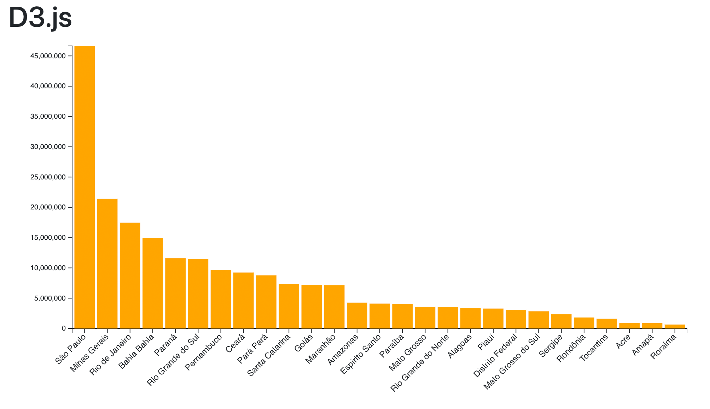

# Material suplementar da aula de D3.js



Para carregar os dados, será necessário utilizar um servidor web. 
Por exemplo, para executar usando PHP, abra o terminal de linha de comando, navegue até o diretório "estudo_caso" e digite:

```php -S localhost:8000```

O site estará disponível em http://localhost:8000/index.html